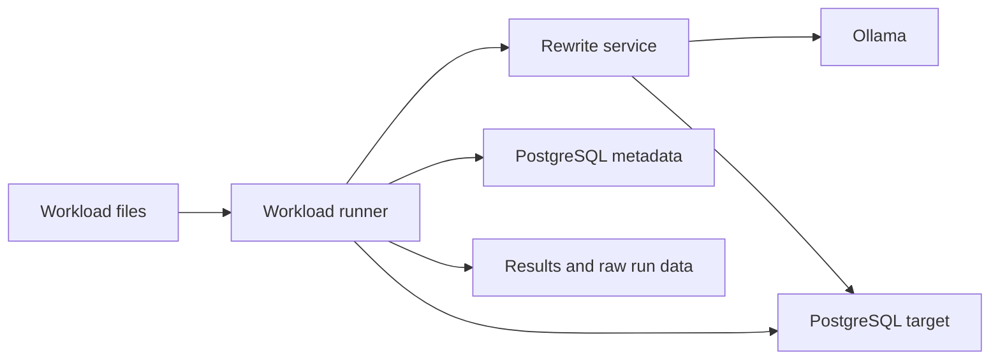

# Feedback-Driven SQL Rewrite Search Prototype

Public research artifact for feedback-driven SQL optimization with validated candidate rewrites.

## Overview

This repository provides a public research artifact for feedback-driven SQL optimization with validated candidate rewrites. It demonstrates a controlled PostgreSQL prototype in which deterministic rules and local LLMs propose candidates, while independent validation, paired benchmarking, provenance tracking, and conservative promotion logic determine whether candidates may be retained for the experimental workload.

The prototype is an experimental PostgreSQL-local workflow, not a production optimizer or a formal proof system. Language models propose candidates only; validation and measurement determine whether candidates proceed.

## Architecture

The prototype separates candidate construction from measurement. The rewrite service parses SQL, applies deterministic rules, builds local-model prompts, parses model responses, and validates candidate result equivalence. The workload runner loads manifests, coordinates benchmark execution, records metadata, and applies promotion criteria. The run scripts export monitoring data, run post-hoc analysis, and package raw run-data artifacts.



See [Implementation and Experiment Specification](specs/02-implementation-and-experiment-spec.md) for the detailed run flow.

## Specifications

- [Research Idea: Feedback-Driven SQL Rewrite Search](specs/00-research-idea.md)
- [System Requirements Specification](specs/01-system-requirements-spec.md)
- [Implementation and Experiment Specification](specs/02-implementation-and-experiment-spec.md)
- [Future Work Not Implemented](specs/03-future-work-not-implemented.md)

## Requirements

- Windows PowerShell
- Docker and Docker Compose
- .NET SDK `10.0.300`
- Python `3.14`
- `uv`
- Ollama-compatible local model runtime through Docker
- Sufficient disk space for generated databases, workload files, model layers, and result artifacts

## Model Selection and VRAM

Reference runs use `qwen3.6:35b-a3b-q4_K_M`. This is not a hidden default: every main run requires an explicit `-Model` argument, and the selected model is recorded in the run metadata.

| Available VRAM | Model Tag | Intended Use |
|----------------|-----------|--------------|
| 32 GB+ | `qwen3.6:35b-a3b-q4_K_M` | Reference configuration |
| Around 16 GB | `qwen2.5-coder:14b` | Lower-capacity reproducibility |
| Less than 16 GB | `qwen2.5-coder:7b` | Minimal fallback; weaker candidate generation expected |

The public run script attempts to pull the requested model through the configured local runtime path if the model is absent. If you also have the host `ollama` CLI installed, these optional manual diagnostics can help inspect model availability:

```powershell
ollama pull <model-tag>
ollama list
```

## Data Preparation

- TPC-H data and the custom real-world anti-pattern corpus are generated locally.
- JOB/IMDB is optional and requires externally staged IMDB CSV files and query resources.
- Raw IMDB CSV files and model files are not committed to this repository.

Prepare the optional JOB/IMDB resources before running the JOB/IMDB corpus:

```powershell
.\scripts\lib\prepare-job-imdb-resources.ps1
```

## Fast Check

Run the lightweight local verification entry point:

```powershell
.\scripts\run-fast-check.ps1
```

## Main Runs

Run one corpus at a time:

```powershell
.\scripts\run-main-run.ps1 -Model qwen3.6:35b-a3b-q4_K_M -Corpus tpch
.\scripts\run-main-run.ps1 -Model qwen3.6:35b-a3b-q4_K_M -Corpus real-world
.\scripts\run-main-run.ps1 -Model qwen3.6:35b-a3b-q4_K_M -Corpus job-imdb
```

Run all main corpora sequentially:

```powershell
.\scripts\run-main-run.ps1 -Model qwen3.6:35b-a3b-q4_K_M -All
```

## Results and Artifacts

- Main runs create machine-readable exports under `experiment-runs/<corpus>/<run-id>/`.
- Raw run-data bundles are written to `experiment-artifacts/` as flat run-id-prefixed files:
  - `<run-id>-raw-run-data.zip`
  - `<run-id>-SHA256SUMS.txt`
- Each run export includes a generated post-hoc Markdown summary covering run provenance, workload outcomes, candidate funnels, source breakdowns, search measurements, any held-out measurements, equivalence checks, null/negative outcomes, and monitoring availability.
- Interpreted article-facing summaries can be added under `experiment-results/` after post-run analysis.
- Raw database volumes, model files, downloaded external data, and unbundled generated outputs are not committed.

## GenAI Use Disclosure

Local language models are studied as candidate generators for SQL rewrites. Generated candidates have no semantic authority: they must pass structural safety checks, empirical result-set validation, and paired benchmarking before any promotion decision.

Coding-agent tools were used as development assistance for drafting, refactoring, code-edit suggestions, debugging, verification planning, and documentation wording. The implementation is not presented as a one-shot generated artifact. Accepted changes were selected, revised, tested where appropriate, and committed as source. Reproducibility is based on the committed specifications, source code, dependency declarations, scripts, run protocols, and recorded evidence, not on replaying nondeterministic prompts.

## Availability and Restrictions

Code, specifications, scripts, and curated materials are available from this repository. Generated datasets and run artifacts are produced locally or committed as flat raw run-data bundles when intentionally curated. JOB/IMDB raw CSV files and local model files are excluded because of size and redistribution restrictions.

## License

Unless otherwise stated, the source code in this repository is licensed under the GNU General Public License v3.0 or later (`GPL-3.0-or-later`). See `LICENSE`.

## Layout

- `specs/`: reader-facing research, requirements, implementation, and future-work specifications
- `src/QueryOptimizer.WorkloadRunner/`: .NET workload runner and coordinator
- `src/rewrite-service/`: FastAPI SQL parsing, rewrite generation, validation, and equivalence service
- `scripts/`: public verification/main-run entry points plus private helpers under `scripts/lib/`
- `tpch-generator/`: local generation of TPC-H, parameterized TPC-H, custom real-world, and JOB/IMDB workload artifacts
- `experiment-results/`: curated human-readable result interpretation added after runs
- `experiment-artifacts/`: flat raw run-data bundles written by main runs
