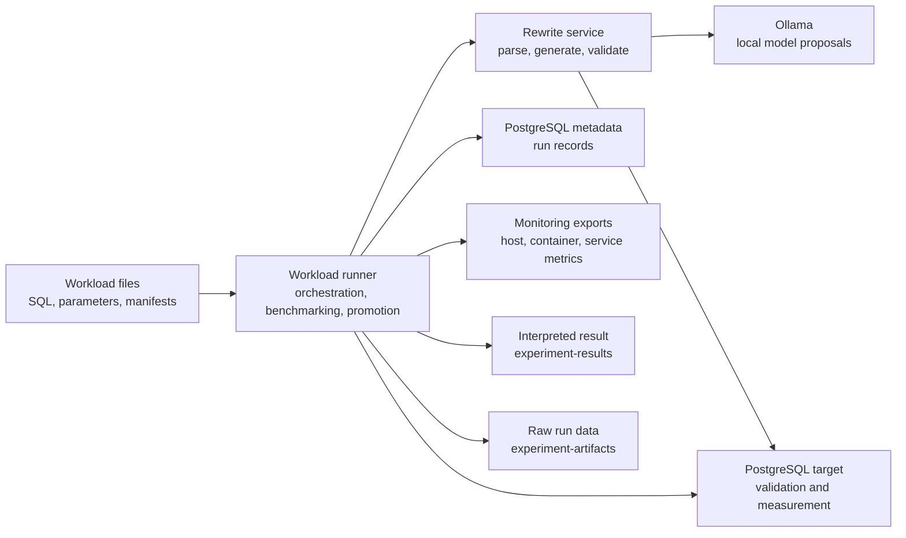

# Implementation and Experiment Specification

## Concrete Implementation

This implementation instantiates the system requirements using PostgreSQL 18.3, a Python 3.14 FastAPI rewrite service, a .NET 10 workload runner, Docker Compose orchestration, and Ollama for local LLM candidate proposals.

## Prototype Architecture

The prototype is split into two main execution components plus run orchestration scripts. The rewrite service owns SQL parsing, deterministic rewrite application, prompt construction, model response parsing, structural candidate checks, and empirical result-set validation. The workload runner owns workload loading, schema-context collection, rewrite-service orchestration, metadata persistence, paired benchmarking, candidate-selection state, promotion decisions, and held-out measurement. The run scripts own Docker orchestration, monitoring export, post-hoc analysis, and raw run-data packaging.

This split is intentional. SQL interpretation and candidate construction stay close to the parser and model prompt logic, while measurement and promotion stay close to the database execution loop. The model can propose SQL, but it cannot bypass validation, benchmarking, or promotion.

| Component | Main Responsibility |
|-----------|---------------------|
| Rewrite service | Parse SQL, generate candidates, validate structure, call the local model, parse responses, compare result sets. |
| Workload runner | Load manifests, execute workloads, record metadata, run paired benchmarks, update candidate state, export results. |
| PostgreSQL | Execute baseline and candidate queries for validation and measurement. |
| Ollama | Provide local model completions for candidate proposals only. |
| Docker Compose | Provide repeatable local orchestration for databases, services, monitoring, and workload execution. |

The diagram intentionally avoids hard-coded Mermaid colors so documentation renderers can apply either light or dark themes.



## Public Commands

These commands define the package command surface for the simplified prototype:

```powershell
.\scripts\run-fast-check.ps1
.\scripts\run-main-run.ps1 -Model <ollama-tag> -Corpus tpch
.\scripts\run-main-run.ps1 -Model <ollama-tag> -Corpus real-world
.\scripts\run-main-run.ps1 -Model <ollama-tag> -Corpus job-imdb
.\scripts\run-main-run.ps1 -Model <ollama-tag> -All
```

## Model Selection

The main experiment scripts require an explicit Ollama model tag. No default model is assumed by the public run commands. The orchestration attempts to pull the requested model if it is not already present. The selected model tag is recorded with the run evidence so that lower-capacity local runs are distinguishable from the reference local-model configuration.

The reference local-model configuration is `qwen3.6:35b-a3b-q4_K_M`. For hardware around 16 GB VRAM, `qwen2.5-coder:14b` is a lower-capacity reproducibility option. For hardware below 16 GB VRAM, `qwen2.5-coder:7b` is a minimal local fallback, with weaker candidate generation expected. Other Ollama model tags may be used when hardware supports them, but each run must pass the selected tag explicitly with `-Model` and record those results separately.

## Implemented Rewrite Surface

The implemented deterministic rewrite surface is intentionally bounded:

| Family | Implemented Rules |
|--------|-------------------|
| A | redundant predicate elimination, boolean simplification, comparison normalization |
| B | positive `IN` to `EXISTS`, conditional `NOT IN` to `NOT EXISTS`, `COUNT(*) > 0` to `EXISTS` |
| C | two-table implicit join to explicit inner join |
| D | redundant outer `GROUP BY` elimination |
| E | subquery column pruning |

The current validation boundary is empirical result-set validation over controlled data and parameter sets. It is evidence for the tested data and parameters, not formal database-wide equivalence.

## Main Run Flow

Each main run follows the same flow:

1. Prepare or reuse the target database and workload files.
2. Start the database, rewrite service, workload runner, local model path, and monitoring.
3. Load a workload manifest that identifies SQL files, parameters, and candidate-pool behavior.
4. Generate rule and model candidates, preserving candidate source metadata.
5. Validate candidates structurally and empirically before any benchmark measurement.
6. Run paired baseline/candidate benchmark measurements and evaluate promotion.
7. Run held-out measurements only for promoted candidates.
8. Export raw run data, checksums, and a separate interpreted result summary.

The flow treats zero candidates, rejected candidates, failed validation, no promotion, and slower rewrites as ordinary reportable outcomes when the workload case itself completes.

## Main Runs

The reportable corpora are TPC-H parameterized SF1, custom real-world anti-patterns over generated TPC-H data, and JOB/IMDB fixed-literal queries. All main runs use mixed candidate generation and monitoring. Mixed generation means deterministic rules and local LLM proposals may both contribute candidates, but each candidate remains untrusted until it passes the configured validation and measurement path.

| Corpus | Purpose | Main command |
|--------|---------|--------------|
| TPC-H parameterized SF1 | Standard analytical benchmark templates with controlled parameters. | `.\scripts\run-main-run.ps1 -Model <ollama-tag> -Corpus tpch` |
| Custom real-world anti-patterns | Smaller targeted cases over generated TPC-H data. | `.\scripts\run-main-run.ps1 -Model <ollama-tag> -Corpus real-world` |
| JOB/IMDB fixed-literal queries | Join-heavy public workload after external artifacts are staged. | `.\scripts\run-main-run.ps1 -Model <ollama-tag> -Corpus job-imdb` |

The optional JOB/IMDB corpus requires external resources to be staged first:

```powershell
.\scripts\lib\prepare-job-imdb-resources.ps1
```

## Run Data Artifacts

Main runs create machine-readable exports under `experiment-runs/<corpus>/<run-id>/`. Each export includes a generated post-hoc Markdown summary covering provenance, workload outcomes, candidate funnels, source breakdowns, search and held-out measurements, equivalence checks, null/negative outcomes, and monitoring availability. Raw run-data bundles are written to `experiment-artifacts/` as flat files named `<run-id>-raw-run-data.zip` and `<run-id>-SHA256SUMS.txt`. Interpreted article-facing summaries can be added under `experiment-results/` after post-run analysis. The checksum file records the raw run-data zip hash so copied artifacts can be verified outside Git.

The raw run-data bundle is intended for audit and replication support, not for narrative interpretation. It contains machine-readable run exports such as the manifest, workload-case outcomes, candidates, equivalence checks, benchmark rows, promotion decisions, post-hoc analysis outputs, workload snapshots, and monitoring extracts when available. The interpreted Markdown result remains outside the zip so it can summarize positive, null, negative, and rejected outcomes without duplicating the raw files.

## Acceptance Criteria

A prototype run is considered usable for reporting when the public command finishes, monitoring is enabled, workload-case outcomes are exported, invalid benchmark pairs are identified, raw run-data and checksums are written, and the interpreted result links back to the run ID and export location. A run may still be a null or negative result if no candidate is promoted.

## Specification-Guided Prototype Development

The implementation is developed against the reader-facing research idea, system requirements, and experiment specification. These specifications provide the stable target for the prototype, but they are not presented as a deterministic source from which the implementation can be regenerated in one pass. Changes to behavior should preserve the separation between candidate generation, structural safety checks, empirical result validation, paired benchmarking, promotion decisions, and evidence recording.

## Implementation Prompt Provenance

The implementation was guided in part by high-level prompts that describe the target prototype, constraints, and required evidence workflow. Those prompts are provenance for development intent, but they are not expected to regenerate byte-identical source code, tests, scripts, manifests, or experiment artifacts. Reproducibility is based on the committed repository contents and recorded run evidence.
